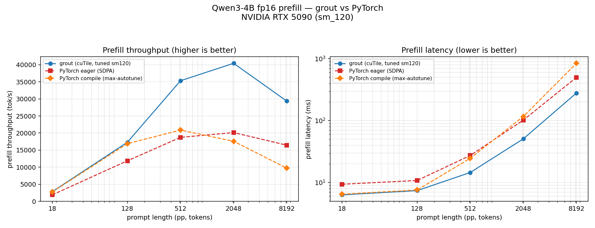

# Qwen3-4B prefill — grout vs PyTorch (RTX 5090 / sm_120)

Prefill-only comparison for [cutile-rs issue #171](https://github.com/NVlabs/cutile-rs/issues/171):
grout (cuTile, tuned sm_120 profile) vs PyTorch `transformers`, eager and
`torch.compile`. grout prefill is **1.46×–2.01× faster than PyTorch eager** across pp=18..8192.

## Method

- **GPU / model**: RTX 5090 (Blackwell sm_120), Qwen3-4B fp16.
- **Pure prefill on both sides**: grout's `prefill_ms` (`prompt_elapsed`, the
  single prompt `step_seq`); PyTorch a single `use_cache=False` forward, CUDA-event
  timed. No decode in either number.
- **PyTorch variants**: eager SDPA (flash-backed), `torch.compile` mode=`default`,
  and mode=`max-autotune`. fp16, no chunking.
- **Identical prompts** generated by `make_prompts.py` (exact token counts).
- Medians over measured reps (n reps per cell: grout (cuTile, tuned sm120)=10, PyTorch eager (SDPA)=5, PyTorch compile (max-autotune)=5). tok/s = prompt_tokens / median prefill ms.
- grout tuned profile via `benchmarks/sweep_pp_sm120.sh`; PyTorch via
  `benchmarks/sweep_pp_pytorch.sh`.

## Prefill throughput (tok/s, higher is better)

| pp | grout (cuTile, tuned sm120) | PyTorch eager (SDPA) | PyTorch compile (max-autotune) | grout vs eager |
|---:|---:|---:|---:|---:|
| 18 | 2,851 | 1,921 | 2,786 | 1.48× |
| 128 | 17,327 | 11,891 | 16,909 | 1.46× |
| 512 | 35,309 | 18,741 | 20,872 | 1.88× |
| 2048 | 40,405 | 20,139 | 17,588 | 2.01× |
| 8192 | 29,349 | 16,457 | 9,721 | 1.78× |

## Prefill latency (median ms, lower is better)

| pp | grout (cuTile, tuned sm120) | PyTorch eager (SDPA) | PyTorch compile (max-autotune) |
|---:|---:|---:|---:|
| 18 | 6.31 | 9.37 | 6.46 |
| 128 | 7.39 | 10.76 | 7.57 |
| 512 | 14.50 | 27.32 | 24.53 |
| 2048 | 50.69 | 101.69 | 116.45 |
| 8192 | 279.12 | 497.80 | 842.74 |

## Plot



## Notes

- On the tuned 5090, grout prefill beats PyTorch eager at every pp — the opposite
  of the RTX 5070 Ti result in the issue, i.e. that gap was tuning/hardware, not
  kernel quality.
- `torch.compile` helps PyTorch at short prompts but **regresses at long context**
  (pp=8192): inductor's fused LM-head matmul over the full prompt is far slower
  than eager's cuBLAS call there, so compiled falls behind eager (and further
  behind grout) at pp=8192.
- grout's own prefill throughput peaks near pp=2048 and dips at pp=8192 — the
  early edge of the long-context `MatMulSlice` scaling tracked in the issue.

## Reproduce

```bash
# grout (writes benchmarks/results/sweep/<ts>/run.jsonl)
./benchmarks/sweep_pp_sm120.sh
# PyTorch eager + compiled (writes benchmarks/results/sweep_pytorch/<ts>/run.jsonl)
./benchmarks/sweep_pp_pytorch.sh
COMPILE_MODE=max-autotune ./benchmarks/sweep_pp_pytorch.sh
# drop the run.jsonl files under benchmarks/pytorch/raw/ then:
python3 benchmarks/pytorch/combine_prefill.py
```

Raw per-rep data for this report lives in [`raw/`](raw/).
